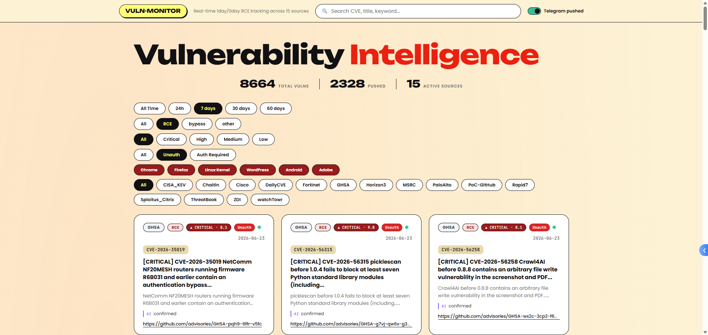

# vuln-monitor

聚合多源 0day/1day RCE 情报，关键词过滤后多通道推送（Telegram / 企业微信 / 钉钉 / 飞书）+ Web 仪表盘。面向安全研究员的个人订阅器。



## 核心特性

- **多源采集（约 18 通道）**：厂商 PSIRT（Fortinet/PaloAlto/Cisco/MSRC）、漏洞披露（ZDI/watchTowr/DailyCVE）、Exploit/PoC（Sploitus_Citrix/PoC-GitHub）、研究（Horizon3/Rapid7）、CISA KEV、长亭/微步、GHSA(+Repo)、CERT_CC/TWCERT
- **模块化源码**：`config` / `scoring` / `db` / `sources` / `notify` / `web` + `static/dashboard.html`；编排在 `vuln_monitor.py`
- **聚焦 RCE + bypass**：模式与 `score()` 在 `src/scoring.py`；短资产词词边界防误伤；CJK `_ab()` 边界
- **增量去重**：SQLite WAL，CVE 主键，60 天 TTL；CVE 年份 >1 年硬 nday
- **统一推送门禁**：配 LLM 时仅 enrich 后推送；公平 enrich 队列（新高优 + 旧积压）；硬约束 freshness/PR=N/非 GitHub
- **多视图查询** + **Web 仪表盘**（localhost 读开放，写接口 magic token）
- **LLM 研判**：DeepSeek/GPT + NVD CVSS；daemon = fetch → enrich → push
- **双服务 systemd**：monitor daemon + web，无需 timer
- **生产级**：文件锁、重试、日志轮转、告警限流、一键部署/卸载

## 快速开始

```bash
git clone https://github.com/Knaithe/1DayNews.git && cd 1DayNews
pip install -r requirements.txt
python src/vuln_monitor.py fetch    # dry-run（不设 TG token 不推送）
python src/web.py                   # Web 仪表盘 http://127.0.0.1:8001
```

## CLI 子命令

```bash
python src/vuln_monitor.py fetch                              # 抓取入库（有 LLM 时不推送）
python src/vuln_monitor.py fetch --no-push                    # 显式只采集
python src/vuln_monitor.py enrich                             # NVD + LLM 研判 + 推送
python src/vuln_monitor.py enrich --dry                       # 研判但不推送
python src/vuln_monitor.py daemon                             # 常驻：fetch→enrich→push（systemd）
python src/vuln_monitor.py query --pushed --days 1            # 简表
python src/vuln_monitor.py query --full --cve CVE-2026-1340   # 详细
python src/vuln_monitor.py brief --pushed --days 1            # 通知格式
python src/vuln_monitor.py stats | rescore | rebuild          # 统计 / 重评 / 回填
```

过滤参数：`--cve` / `--source` / `--keyword` / `--days` / `--pushed` / `--reason` / `--limit`

## Web 仪表盘

```bash
python src/web.py                    # http://127.0.0.1:8001
ssh -L 8001:127.0.0.1:8001 user@srv  # 远程 SSH 隧道访问
```

Pluto Security 风格暖色卡片布局，实时搜索，药丸式源/原因/时间筛选，严重性颜色编码。默认只显示精选（pushed），可切换全量。**双击卡片**弹出备注编辑器（≤200 字，记使用情况/复现状态），统计栏显示**最近一次抓取时间 + 条数**。安全加固（CSP/X-Frame-Options/nosniff），waitress + SQLite（读为主；备注/标签/复现走 POST，**即使 localhost 也要 magic token**）。详见 [`docs/web-dashboard.md`](docs/web-dashboard.md)。

## 推送通道

支持 4 个推送通道，按需配置，不配则跳过（dry mode）。每个通道独立跟踪发送状态，互不影响。

```bash
python scripts/configure.py          # 交互式配置所有凭证
python src/vuln_monitor.py fetch     # 配置后自动推送到已启用通道
```

优先级：环境变量 > 配置文件 > 空（dry mode）。

### Telegram

`TG_CHAT_ID` 支持多频道/群/个人同时推送：`-100xxx,-100yyy,123456`

### 企业微信（WeCom）

群聊 → 右键 → 添加群机器人 → 复制 Webhook URL 中的 `key` 参数。频率限制 20 条/分钟。

### 钉钉（DingTalk）

群设置 → 智能群助手 → 添加机器人 → 自定义 Webhook → 复制 `access_token`。建议开启「加签」安全设置并填写 `DINGTALK_WEBHOOK_SECRET`。频率限制 20 条/分钟。

### 飞书（Feishu）

群设置 → 群机器人 → 添加自定义机器人 → 复制完整 Webhook URL。频率限制 100 条/分钟。

### 凭证配置

| 变量 | 用途 | 获取 |
|---|---|---|
| `TG_BOT_TOKEN` | Telegram 推送 | @BotFather |
| `TG_CHAT_ID` | Telegram 目标（逗号分隔多个） | @userinfobot / @RawDataBot |
| `WECOM_WEBHOOK_KEY` | 企业微信群机器人 | 群聊 → 添加群机器人 → Webhook URL 中的 key |
| `DINGTALK_WEBHOOK_TOKEN` | 钉钉群机器人 | 群设置 → 智能群助手 → Webhook URL 中的 access_token |
| `DINGTALK_WEBHOOK_SECRET` | 钉钉加签密钥（可选） | 创建机器人时勾选「加签」→ 复制 SEC 开头的密钥 |
| `FEISHU_WEBHOOK_URL` | 飞书群机器人 | 群设置 → 群机器人 → 复制完整 Webhook URL |
| `GH_TOKEN` | GitHub API 限频 60→5000 次/小时 | GitHub → Settings → Developer settings → PAT |
| `NVD_API_KEY` | NVD API 限频 5→50 次/30 秒 | https://nvd.nist.gov/developers/request-an-api-key |
| `DEEPSEEK_API_KEY` | LLM 研判（推荐，便宜） | https://platform.deepseek.com |
| `OPENAI_API_KEY` | LLM 研判（备选） | https://platform.openai.com |
| `LLM_MODEL` | 模型名（默认 deepseek-chat） | 可选 |
| `LLM_BASE_URL` | 自定义 API 端点 | 可选，兼容任意 OpenAI 格式 |

### LLM 研判（可选）

配了 `DEEPSEEK_API_KEY` 或 `OPENAI_API_KEY` 后，`enrich` 子命令会用 LLM 做二次研判。以下是每个模型的完整 .env 配置示例，选一个复制到 `.env` 即可。

#### DeepSeek deepseek-v4-flash（推荐，便宜快速，1M 上下文）

```bash
DEEPSEEK_API_KEY=sk-xxxxxxxxxxxxxxxx
LLM_MODEL=deepseek-v4-flash
LLM_TEMPERATURE=0.1
LLM_MAX_TOKENS=4096
LLM_TIMEOUT=60
LLM_MAX_CONTEXT=1048576
LLM_REASONING_EFFORT=high
LLM_TOP_P=0.9
```

#### OpenAI GPT-5.4（性价比，1M 上下文）

```bash
OPENAI_API_KEY=sk-xxxxxxxxxxxxxxxx
LLM_MODEL=gpt-5.4
LLM_TEMPERATURE=0.1
LLM_MAX_TOKENS=4096
LLM_TIMEOUT=60
LLM_MAX_CONTEXT=1050000
LLM_REASONING_EFFORT=high
LLM_TOP_P=0.9
```

#### OpenAI GPT-5.5（最准，1M 上下文）

```bash
OPENAI_API_KEY=sk-xxxxxxxxxxxxxxxx
LLM_MODEL=gpt-5.5
LLM_TEMPERATURE=0.1
LLM_MAX_TOKENS=8192
LLM_TIMEOUT=90
LLM_MAX_CONTEXT=1000000
LLM_REASONING_EFFORT=high
LLM_TOP_P=0.9
```

#### 第三方中转（OpenRouter / 自建代理）

```bash
OPENAI_API_KEY=sk-xxxxxxxxxxxxxxxx
LLM_BASE_URL=https://openrouter.ai/api
LLM_MODEL=deepseek/deepseek-chat
LLM_TEMPERATURE=0.1
LLM_MAX_TOKENS=4096
LLM_TIMEOUT=60
LLM_MAX_CONTEXT=131072
LLM_REASONING_EFFORT=high
LLM_TOP_P=0.9
```

#### 本地 Ollama（受本地显存限制）

```bash
OPENAI_API_KEY=ollama
LLM_BASE_URL=http://localhost:11434
LLM_MODEL=llama3
LLM_TEMPERATURE=0.1
LLM_MAX_TOKENS=2048
LLM_TIMEOUT=120
LLM_MAX_CONTEXT=8192
LLM_REASONING_EFFORT=high
LLM_TOP_P=0.9
```

#### 参数说明

| 参数 | 默认 | 说明 |
|---|---|---|
| `LLM_TEMPERATURE` | 0.1 | 创造性，0=完全确定性，1=最大随机 |
| `LLM_MAX_TOKENS` | 1024 | 最大输出 token 数（GPT-5.5 建议 8192） |
| `LLM_TIMEOUT` | 60 | API 超时秒数，推理模型建议 120 |
| `LLM_MAX_CONTEXT` | 1048576 | 上下文窗口（1M），GPT-5.4/5.5/DeepSeek-V4 均为百万级 |
| `LLM_REASONING_EFFORT` | high | 思考等级：low / medium / high，支持的模型才生效 |
| `LLM_TOP_P` | 0.9 | 核采样，和 temperature 配合控制输出多样性 |

自定义 system prompt 放 `/opt/vuln-monitor/llm_prompt.txt`，不存在则用内置默认。不支持 temperature / tools / reasoning_effort 的模型会自动降级重试。

### 判定逻辑

```
漏洞记录进入
│
├─ 1. regex score() → reason + vuln_type + category
│  ├─ _STRONG_RCE_RE 命中（RCE/remote code execution 等）→ 跳过 exclude 检查
│  │   （XSS→RCE / SSRF→RCE 链不会被 XSS/SSRF exclude 拦住）
│  ├─ excluded → 不推，不审
│  ├─ no hit → 不推，不审
│  ├─ RCE+asset+CVE / RCE+asset / RCE+CVE / RCE → vuln_type=RCE
│  ├─ bypass+asset+CVE / bypass+CVE / bypass+asset / bypass → vuln_type=bypass
│  └─ asset+CVE → vuln_type=other（候选，等 LLM 研判）
│
├─ 1b. classify_category() → 9 类 dashboard 维度
│  优先级：escape > RCE > excluded→other > SQLi > privilege escalation
│         > bypass > data leak > XSS/SSRF > DoS > other
│  特殊规则：
│  ├─ 内存破坏（overflow/UAF/OOB）永远不归 DoS
│  ├─ vuln_type=RCE 但标题说 privilege escalation → 降级为 privesc
│  │   （标题同时有 RCE/command injection 则不降）
│  └─ sandbox/container/VM escape → escape（独立于 RCE）
│
├─ 2. freshness → _is_fresh()（所有源均过 NVD 验证）
│  ├─ 所有 CVE 年份 > 1 年 → nday（无例外，高信任也不豁免）
│  ├─ 高信任源（FRESH_SOURCES）：
│  │  ├─ NVD 确认 ≤60 天 → 1day
│  │  ├─ NVD 确认 >60 天 → nday（nvd_stale）
│  │  └─ NVD 无数据 → CVE 年份兜底（recent year → 1day）
│  ├─ 低信任源 + NVD 确认 ≤60 天 → 1day
│  ├─ 低信任源 + NVD 无数据/超期 → nday
│  └─ 低信任源 + 无 CVE → nday（no_cve_low_trust）
│
├─ 3. 初始推送（fetch 阶段，仅 RCE/bypass 直推）
│  ├─ GitHub/PoC-GitHub → pushed=0（候选，永不推送）
│  ├─ CVSS PR≠N 或 PR 未知 → pushed=0（必须无需认证才推送）
│  ├─ vuln_type 非 RCE/bypass → pushed=0（asset+CVE 等 LLM 研判）
│  └─ RCE/bypass + freshness=1day + PR=N + UI≠R → pushed=1
│
├─ 4. LLM enrich → verdict: confirmed / not_relevant / noise
│  ├─ 高优先源（HIGH_PRIORITY_SOURCES）+ CVSS≥9 → auto-confirm（跳 LLM）
│  ├─ 高信任源 + 已有真实 severity/cvss → 跳过工具调用，LLM 直接判定
│  ├─ 其他 → LLM 调用工具（NVD/URL/GitHub/长亭）后判定
│  ├─ LLM 连续出错 >3 次 → fallback：未验证 + scored + PR=N 的记录直接 pushed=1
│  └─ _resolve_pushed()
│     ├─ freshness≠1day → 锁 0（LLM 不可推翻）
│     ├─ GitHub/PoC-GitHub → 锁 0
│     ├─ CVSS PR≠N 或未知 → 锁 0
│     ├─ CVSS UI=R（需交互） → 锁 0
│     └─ verdict 决定（confirmed=1，not_relevant/noise=0）
│
└─ 5. pushed=1 → 多通道推送（Telegram / 企业微信 / 钉钉 / 飞书，各通道独立跟踪）
```

**源信任集合（代码中有两个不同集合）：**

| 集合 | 用途 | 成员 |
|---|---|---|
| `FRESH_SOURCES` | freshness 判定 + LLM 跳工具 | Fortinet/PaloAlto/Cisco/MSRC/CISA_KEV/ZDI/watchTowr/Horizon3/Rapid7/Chaitin/DailyCVE/GHSA |
| `HIGH_PRIORITY_SOURCES` | auto-confirm (CVSS≥9) | Fortinet/PaloAlto/Cisco/CISA_KEV/ZDI/watchTowr/MSRC/Horizon3/Chaitin/ThreatBook |

**核心规则：** RCE/bypass + freshness=1day + PR=N 直推 · asset+CVE 等 LLM 研判 · GitHub/PoC-GitHub 仅候选 · 所有源均过 NVD 验证 · LLM verdict 覆写 pushed 但受 freshness/source/PR/UI 硬约束 · LLM 出错兜底走正则

**数据字段：**

| 字段 | 含义 | 示例值 |
|---|---|---|
| `reason` | 详细匹配原因 | `RCE+asset+CVE` / `RCE+CVE` / `bypass+asset+CVE` / `bypass+CVE` / `asset+CVE` |
| `vuln_type` | 漏洞分类（score 维度） | `RCE` / `bypass` / `other` |
| `category` | 细粒度分类（dashboard 维度） | `escape` / `RCE` / `SQLi` / `privilege escalation` / `bypass` / `data leak` / `XSS/SSRF` / `DoS` / `other` |
| `freshness` | 新鲜度 | `1day` / `nday` |
| `freshness_reason` | 判定依据 | `high_trust_source` / `nvd_60d` / `nvd_stale` / `old_cve` / `no_cve_low_trust` |
| `llm_verdict` | LLM 判定 | `confirmed` / `not_relevant` / `noise` |
| `pushed` | 最终推送 | 0 / 1 |

不配 LLM key 时 enrich 跳过 LLM 步骤，直接走正则结果推送，不影响现有功能。

部署后 `vuln-monitor.service` daemon 每 5 分钟自动执行 `fetch → enrich`，通过 `FETCH_INTERVAL` 环境变量调整间隔（秒）。

## 一键部署

```bash
curl -sSL https://raw.githubusercontent.com/Knaithe/1DayNews/master/deploy.sh | sudo bash
```

部署后两个 systemd 服务，管理：

```bash
systemctl status vuln-monitor.service     # 采集 daemon
systemctl status vuln-web.service         # Web 仪表盘
sudo systemctl restart vuln-monitor.service  # 重启采集
sudo systemctl restart vuln-web.service      # 重启 Web
journalctl -u vuln-monitor.service -f     # 采集日志
```

卸载：`sudo bash uninstall.sh`（保留数据）或 `sudo bash uninstall.sh --purge`（彻底清除）。

## Claude Code / openclaw

```bash
cd /opt/vuln-monitor && claude
/vuln                            # 加载 skill
```

| 操作 | 说法 |
|---|---|
| 抓取 | "fetch" / "更新" |
| 查询 | "最近有什么新漏洞" / "查一下 CVE-2026-1340" |
| 转发格式 | "Fortinet 最近的漏洞，给我可以转发的格式" |
| 统计 | "stats" |

## 文档

| 主题 | 文档 |
|---|---|
| 目录布局、数据流、部署机制 | [`docs/architecture.md`](docs/architecture.md) |
| 数据源清单与评估 | [`docs/sources.md`](docs/sources.md) |
| RCE 过滤规则 | [`docs/filtering.md`](docs/filtering.md) |
| 运维、日志、故障定位 | [`docs/operations.md`](docs/operations.md) |
| Web 仪表盘 | [`docs/web-dashboard.md`](docs/web-dashboard.md) |
| Vulnpilot API（/api/pending） | [`docs/api-vulnpilot.md`](docs/api-vulnpilot.md) |

## API

dashboard 与外部消费者共用的接口（均走 web dashboard token 鉴权；loopback 免鉴权）：

| 端点 | 方法 | 说明 |
|---|---|---|
| `/api/vulns` | GET | 主查询：漏洞列表，支持 q/source/category/severity/pr/ui/reproduced/pushed/days/limit 过滤 |
| `/api/stats` | GET | 聚合统计：total/pushed + 按源·类别·复现分组 + `fetch`（最近抓取时间/条数） |
| `/api/sources` | GET | 去重的源名列表（近 7d） |
| `/api/reproduced` | POST | 设置某条记录的复现标记 `{key, reproduced∈{-1,0,1,2}}` |
| `/api/note` | POST | 设置/清空某条记录的备注 `{key, note}`（≤200 字，非字符串→400） |
| `/api/pending` | GET | **B 机拉取**：最近 7 天 `pushed=1`，固定字段、上限 1000（不含 note），无外部参数 |

写接口（`/api/reproduced`、`/api/note`）走共享 `_set_vuln_field` 助手：参数化 SQL、缺列自动迁移、锁重试、未知 key→404。`/api/pending` 鉴权：`Authorization: Bearer <token>` / `?token=` / Cookie。B 侧自行维护 CVE 去重。详见 [`docs/api-vulnpilot.md`](docs/api-vulnpilot.md)。

## 许可

个人使用。源站 TOS 不允许高频爬取的（比如 `sec.cloudapps.cisco.com`），请自觉降低频率。
